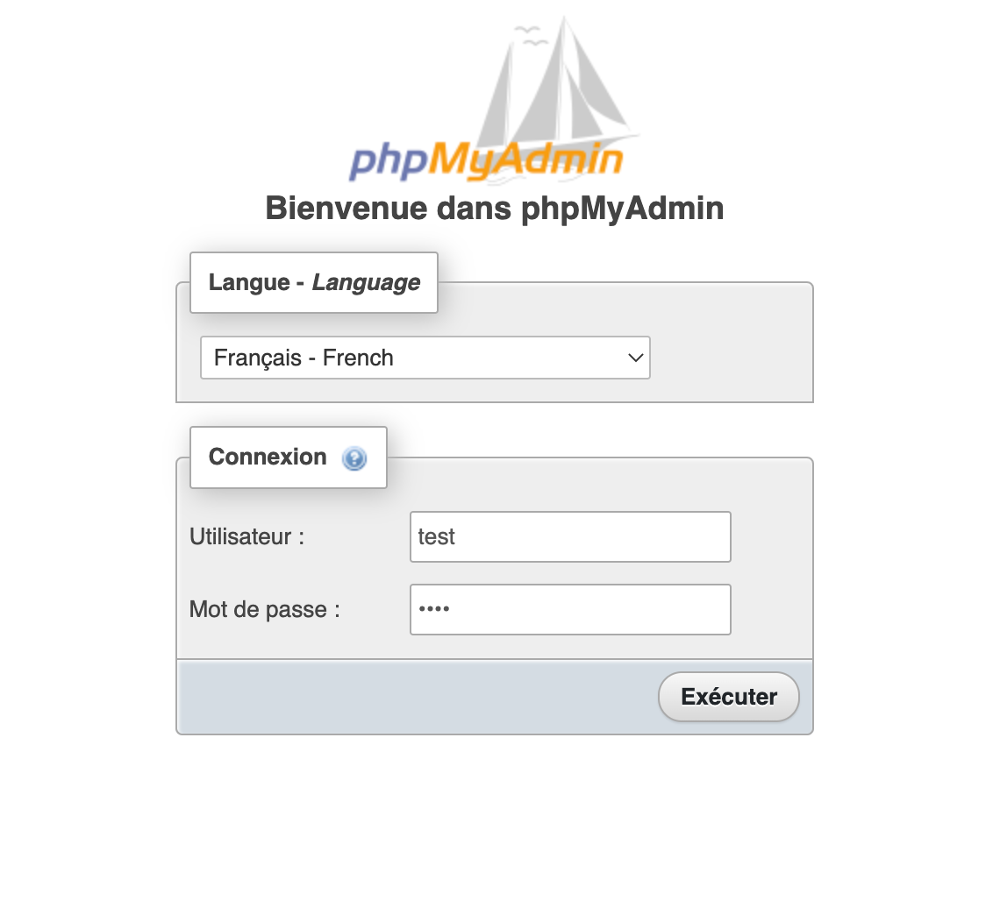

# Sample MySQL and phpMyAdmin

## TL;DR

### Prerequisites

* [Docker Desktop](https://docs.docker.com/get-docker/) installed

### Clone the repository

```
git clone https://github.com/nntran/mysql-php-sample.git
````

### Launch the project

```
docker-compose up -d
```

Now you can access to the phpMyAdmin application whith this url: http://localhost:8080



Use the user `user` and the password `test` to connect to the phpMyAdmin.

### Stop all applications (containers)

```
docker-compose stop
```
